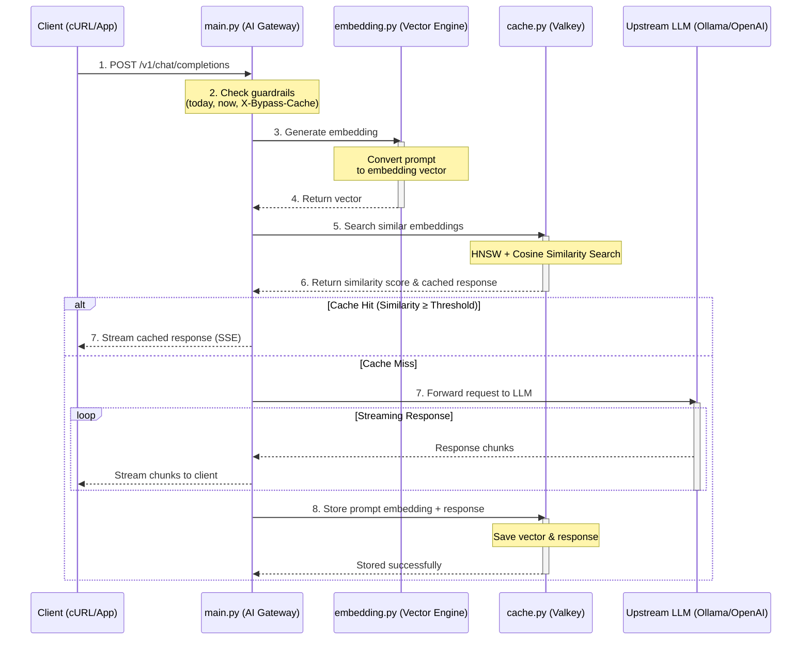

# What problem did we solve?

- Imagine you have an application that uses ChatGPT or Ollama. Normally, every time a user asks a question, your application sends that request to the AI model.
  That causes two problems

  - It's slow – AI models can take a few seconds to generate an answer.
  - It's expensive – if thousands of users ask the same question in different ways, you're paying the AI to generate the same answer repeatedly.

# Solution tried is to build an AI Gateway with Semantic Caching

- Instead of sending every request to the AI, the gateway first checks whether a very similar question has already been answered. If it finds one, it returns the cached answer in a few milliseconds instead of calling the AI again. So the gateway sits between the client and the AI model.

## Sequence of calls from the code



## Step by step installation
- Prerequisites: Make sure your machine has the following tools installed:
  - Python 3.11+
  - Poetry (Python dependency and environment packager)
  - Docker Desktop (To run your in-memory database service layers)
  - Ollama (Running locally with llama3 pulled: ollama run llama3)
- Workspace Initialization
  - mkdir -p f9-ai-gateway/gateway f9-ai-gateway/tests
  - cd f9-ai-gateway
  - touch .env pyproject.toml docker-compose.yml
  - touch gateway/config.py gateway/embedding.py gateway/cache.py gateway/main.py
  - touch tests/run_scenarios.py
- Base configurations (.env & pyproject.toml)
  ``` bash
  HOST=0.0.0.0
  PORT=8000
  VALKEY_HOST=127.0.0.1
  VALKEY_PORT=6379
  VALKEY_INDEX_NAME=llm_semantic_cache
  SIMILARITY_THRESHOLD=0.92
  CACHE_TTL=3600
  UPSTREAM_LLM_URL=http://localhost:11434/v1
  UPSTREAM_LLM_MODEL=llama3
  ```

## App starup
  ``` bash
  poetry lock
  poetry install
  eval $(poetry env activate) # Activates the local isolated shell tracking loops
  ```

## Verification test
 ``` bash
  python tests/run_scenarios.py
 ```
